# 🤖 RoboFace: Native Vector Emotion Animation

[](https://kotlinlang.org)
[](https://developer.android.com)
[](https://developer.android.com/jetpack/compose)
[](https://www.tensorflow.org/lite)

> **Experience the future of digital-human interaction.** RoboFace is a high-fidelity, sensor-reactive Android entity that bridges the gap between hardware and emotion using real-time vector animation.

---

## 📑 Table of Contents
- [✨ Overview](#-overview)
- [✨ Key Features](#-key-features)
- [🔄 End-to-End Workflow](#-end-to-end-workflow)
- [🏗️ System Architecture](#-system-architecture)
- [💻 Languages & Technologies](#-languages--technologies)
- [📦 Libraries & Dependencies](#-libraries--dependencies)
- [🧠 How It Works](#-how-it-works)
- [🎮 How to Interact](#-how-to-interact)
- [🚀 Getting Started](#-getting-started)
- [⚡ Build & Run](#-build--run)
- [🛠️ Physical Device Setup](#️-physical-device-setup)
- [📊 Performance Metrics](#-performance-metrics)
- [🗂️ Project Structure](#️-project-structure)

---

## ✨ Overview

RoboFace is an advanced Android application that creates an emotionally responsive robotic face using entirely vector-based graphics. The application leverages device sensors (accelerometer, gyroscope, proximity, microphone) to create a living, breathing digital entity that reacts to user interactions and environmental stimuli in real-time.

Built with modern Android development practices, RoboFace demonstrates the power of Jetpack Compose Canvas API for creating complex, performant animations without relying on traditional image assets or pre-rendered graphics.

---

## ✨ Key Features

- **Dynamic Vector Rendering**: Pixel-perfect face components drawn entirely using Jetpack Compose `Canvas`
- **Real-time Sensor Fusion**: Merges Accelerometer, Gyroscope, Proximity, and Microphone data for complex behavioral responses
- **Neon-Glow Aesthetics**: Premium futuristic design with smoothed spring animations and HSL-based color transitions
- **On-Device Metrics**: Real-time performance overlay showing inference latency and sensor tilt vectors
- **Zero Image Assets**: 100% programmatically drawn interface with no static images
- **Emotion Intelligence**: Smart state-based emotion engine that evaluates environmental factors every 500ms
- **60+ FPS Rendering**: Frame-locked to device refresh rate for buttery smooth animations

---

## 🔄 End-to-End Workflow

### 1️⃣ **Sensor Data Collection**
The application continuously monitors four primary input sources:
- **Accelerometer**: Detects device tilt and movement intensity
- **Gyroscope**: Tracks rotational orientation for eye pupil tracking
- **Proximity Sensor**: Detects when the device is covered (e.g., face-down or near objects)
- **Microphone**: Monitors ambient sound levels in decibels (requires RECORD_AUDIO permission)

### 2️⃣ **Input Processing**
- `SensorInputManager` processes accelerometer and gyroscope data at hardware sensor rates
- `AudioInputManager` samples audio amplitude and converts to dB scale
- Shake detection uses magnitude thresholding on acceleration vectors
- Proximity events trigger instant state changes

### 3️⃣ **Emotion Evaluation**
- `EmotionEngine` evaluates all metrics every 500ms
- Applies priority-based state machine logic:
  - **High Priority**: Angry (shake), Sleep (proximity/idle)
  - **Medium Priority**: Happy (sustained movement), Irritated (loud noise)
  - **Low Priority**: Sad (inactivity), Curious (default)
- Minimum emotion duration of 2 seconds prevents rapid flickering

### 4️⃣ **State Propagation**
- Current emotion state flows through Kotlin StateFlow
- UI components subscribe to emotion changes reactively
- Tilt values (X, Y, rotation) update eye pupil positions

### 5️⃣ **Vector Rendering**
- `FaceComponents.kt` draws all visual elements using Canvas API:
  - Eyes with dynamic pupils, lids, and glow effects
  - Mouth with emotion-specific shapes (smile, frown, flat-line)
  - Animated jitter and color transitions (HSL color space)
- Spring-based animations smooth all transitions
- 60 FPS rendering locked to device refresh rate

### 6️⃣ **Performance Monitoring**
- Optional debug overlay displays:
  - Emotion state and duration
  - Sensor tilt vectors (X, Y, Z)
  - TensorFlow Lite inference latency (infrastructure for future AI features)

---

## 🏗️ System Architecture

The application follows a **Decoupled Input Pipeline** with reactive state management:

```mermaid
graph TD
    subgraph Hardware ["🔌 Hardware Layer"]
        A1[Accelerometer]
        A2[Gyroscope]
        A3[Proximity Sensor]
        A4[Microphone]
    end

    subgraph Managers ["⚙️ Input Managers"]
        B1[SensorInputManager]
        B2[AudioInputManager]
    end

    subgraph Engine ["🧠 Processing Engine"]
        C1[EmotionEngine]
        C2[BehaviorMetrics]
        C3[StateFlow Streams]
    end

    subgraph UI ["🎨 UI Layer - Jetpack Compose"]
        D1[MainActivity]
        D2[RoboFace Composable]
        D3[Eyes Canvas]
        D4[Mouth Canvas]
        D5[Performance Overlay]
    end

    subgraph Support ["🛠️ Support Services"]
        E1[TFLiteManager]
        E2[PerformanceMonitor]
    end

    A1 --> B1
    A2 --> B1
    A3 --> B1
    A4 --> B2
    
    B1 -->|Shake/Tilt/Rotation| C1
    B2 -->|Sound Level dB| C1
    
    C1 --> C2
    C2 --> C3
    C3 -->|Emotion StateFlow| D2
    C3 -->|Tilt StateFlow| D3
    
    D1 --> D2
    D2 --> D3
    D2 --> D4
    D2 --> D5
    
    E1 -.->|Future AI| C1
    C1 --> E2
```



### **Architecture Components**

| Component | Responsibility | Technology |
|:----------|:---------------|:-----------|
| **MainActivity** | Entry point, lifecycle management, permission handling | Activity + Compose |
| **EmotionEngine** | Core state machine, emotion evaluation loop | Kotlin Coroutines + StateFlow |
| **SensorInputManager** | Hardware sensor abstraction, shake detection | Android SensorManager API |
| **AudioInputManager** | Audio amplitude sampling, dB conversion | AudioRecord API |
| **FaceComponents** | Vector drawing functions for eyes and mouth | Canvas API + DrawScope |
| **BehaviorMetrics** | Data class holding all behavioral state | Kotlin Data Class |
| **TFLiteManager** | TensorFlow Lite infrastructure (future use) | TFLite 2.14 |
| **PerformanceOverlay** | Debug metrics display | Compose UI |

---

## 💻 Languages & Technologies

### **Primary Language**
- **Kotlin 1.9+** - 100% Kotlin codebase leveraging:
  - Coroutines for asynchronous processing
  - StateFlow for reactive state management
  - Extension functions for Canvas drawing
  - Data classes for state modeling

### **Frameworks & Toolkits**
- **Jetpack Compose** - Modern declarative UI framework
  - Canvas API for custom vector drawing
  - Material3 design system
  - Compose Runtime for state observation
- **Android SDK 26+** (Oreo and above)
  - SensorManager for device sensors
  - AudioRecord for microphone access
  - Permission system (RECORD_AUDIO)

### **Build System**
- **Gradle 8.2** with Kotlin DSL
- **Android Gradle Plugin 8.2.0**
- **Kotlin Compiler Extension 1.5.1** (for Compose)

---

## 📦 Libraries & Dependencies

### **Core Android Libraries**
```kotlin
androidx.core:core-ktx:1.12.0                    // Kotlin extensions
androidx.lifecycle:lifecycle-runtime-ktx:2.7.0   // Lifecycle-aware components
androidx.activity:activity-compose:1.8.2         // Activity integration with Compose
```

### **Jetpack Compose Stack**
```kotlin
androidx.compose:compose-bom:2023.08.00          // Bill of Materials (version management)
androidx.compose.ui:ui                           // Core Compose UI
androidx.compose.ui:ui-graphics                  // Graphics primitives & Canvas
androidx.compose.ui:ui-tooling-preview           // Preview annotations
androidx.compose.material3:material3             // Material Design 3 components
```

### **TensorFlow Lite (AI Infrastructure)**
```kotlin
org.tensorflow:tensorflow-lite:2.14.0            // Core TFLite runtime
org.tensorflow:tensorflow-lite-gpu:2.14.0        // GPU acceleration support
org.tensorflow:tensorflow-lite-gpu-api:2.14.0    // GPU delegate API
```

### **Permissions Required**
- `android.permission.RECORD_AUDIO` - For microphone sound level monitoring

---

## 🧠 How It Works

### **Emotion State Machine**

The `EmotionEngine` evaluates environmental factors every **500ms** (twice per second) and assigns emotions based on priority:

| Emotion | Priority | Trigger Condition | Visual Characteristics |
|:--------|:---------|:------------------|:----------------------|
| **😴 Sleep** | 🔴 High | Proximity covered **OR** Still > 15s | Dimmed UI, closed eyelids, flat mouth |
| **😡 Angry** | 🔴 High | Fast shake detected (3+ shakes in 2s) | Red pulsing, rapid jitter, sharp teeth |
| **😊 Happy** | 🟢 Medium | Activity level > 0.5 (sustained movement) | Green glow, wide smile, bright eyes |
| **😠 Irritated** | 🟡 Medium | Ambient sound > 60 dB | Orange tint, squinted eyes, wavy mouth |
| **😢 Sad** | 🔵 Low | Still for 6-15 seconds | Blue tone, drooping eyelids, frown |
| **🤔 Curious** | 🟣 Low | Default baseline state | Cyan glow, neutral expression, active pupils |

### **Sensor Processing Pipeline**

#### **Shake Detection Algorithm**
```kotlin
val magnitude = sqrt(x² + y² + z²)
if (magnitude > SHAKE_THRESHOLD && timeSinceLastShake > 300ms) {
    shakeCount++
    if (shakeCount >= 3 within 2s) → ANGRY
}
```

#### **Activity Level Calculation**
```kotlin
activityLevel = exponentialMovingAverage(
    current: sqrt(tiltX² + tiltY²),
    previous: activityLevel,
    alpha: 0.3  // Smoothing factor
)
```

#### **Sound Level Processing**
```kotlin
amplitude = audioSamples.max()
soundLevelDB = 20 * log10(amplitude / referenceAmplitude)
if (soundLevelDB > 60) → IRRITATED
```

### **Rendering Pipeline**

1. **Eye Drawing** (`FaceComponents.kt`)
   - Outer glow ring with emotion-specific color (HSL)
   - White sclera with subtle gradient
   - Dynamic eyelid based on emotion (open/closed/squinted)
   - Pupil positioned based on device tilt (gyroscope data)
   - Jitter offset for Angry state

2. **Mouth Drawing**
   - Bezier curves for emotion-specific shapes
   - Happy: Upward curve (smile)
   - Sad: Downward curve (frown)
   - Sleep: Flat line
   - Irritated: Wavy line
   - Animated width and curvature transitions

3. **Animation System**
   - Spring physics for smooth transitions (dampingRatio, stiffness)
   - Color interpolation in HSL space (better than RGB for glow effects)
   - Frame-locked rendering at device refresh rate (60/90/120 FPS)

---

## 🎮 How to Interact

Experience RoboFace's emotional intelligence through physical interactions:

| 🎯 Action | 🤖 Response | 💡 Technical Detail |
|:----------|:-----------|:--------------------|
| **Tilt the phone** | Pupils track device orientation | Gyroscope data maps to eye offset coordinates |
| **Move smoothly** | Becomes "Happy" with green glow | Activity level > 0.5 threshold |
| **Shake vigorously** | Enters "Angry" state with red pulse | 3+ shakes detected within 2 seconds |
| **Cover proximity sensor** | Instantly goes to "Sleep" | Top sensor covered → instant state change |
| **Shout or play loud music** | Becomes "Irritated" with orange tint | Sound level exceeds 60 dB threshold |
| **Leave motionless** | Becomes "Sad" then sleeps | 6s still → Sad, 15s still → Sleep |
| **Gentle rock** | Returns to "Curious" baseline | Low continuous movement |

---

## 🚀 Getting Started

### **Prerequisites**

Before you begin, ensure you have the following installed:

1. **Java Development Kit (JDK)**
   - Version: JDK 17 or higher (JDK 21 recommended)
   - Download: [Oracle JDK](https://www.oracle.com/java/technologies/downloads/) or [OpenJDK](https://adoptium.net/)
   - Verify installation: `java -version`

2. **Android SDK**
   - Option A: Install via [Android Studio](https://developer.android.com/studio) (recommended)
   - Option B: Install [Command Line Tools](https://developer.android.com/studio#command-line-tools-only) standalone
   - Minimum required: **API Level 26** (Android 8.0 Oreo)
   - Recommended: **API Level 34** (Android 14)

3. **Gradle** (Optional - bundled with project)
   - The project includes Gradle Wrapper
   - For manual installation: [Gradle 8.2+](https://gradle.org/install/)

4. **Android Device or Emulator**
   - Physical device recommended for best sensor experience
   - USB Debugging enabled
   - Android 8.0 (API 26) or higher

---

### **Clone the Repository**

```bash
# Clone via HTTPS
git clone https://github.com/Sujay149/Aimer--Task-2-Native-Vector-Robo-Face-with-Emotion-Animation-Core-Task-.git

# Navigate to project directory
cd Aimer--Task-2-Native-Vector-Robo-Face-with-Emotion-Animation-Core-Task-

# OR Clone via SSH
git clone git@github.com:Sujay149/Aimer--Task-2-Native-Vector-Robo-Face-with-Emotion-Animation-Core-Task-.git
```

---

### **Configure Android SDK Path**

Create a `local.properties` file in the project root directory:

**Windows:**
```properties
sdk.dir=C\:\\Users\\YOUR_USERNAME\\AppData\\Local\\Android\\Sdk
```
*(Note: Use double backslashes `\\` for Windows paths)*

**macOS/Linux:**
```properties
sdk.dir=/Users/YOUR_USERNAME/Library/Android/sdk
```

**Finding your SDK path:**
- In Android Studio: `File → Settings → Appearance & Behavior → System Settings → Android SDK`
- The path is shown at the top of the Android SDK settings page

---

## ⚡ Build & Run

### **Method 1: Using Android Studio (Recommended)**

1. **Open Project**
   ```
   File → Open → Select the project directory
   ```

2. **Sync Gradle**
   - Android Studio will automatically sync dependencies
   - Wait for "Gradle sync finished" message

3. **Connect Device**
   - Enable USB Debugging on your Android device
   - Connect via USB cable
   - Authorize the computer on your device

4. **Run Application**
   - Click the green **Run** button (▶️) or press `Shift + F10`
   - Select your connected device or create an emulator
   - Wait for build and installation

---

### **Method 2: Command Line (Gradle)**

#### **Windows (PowerShell)**

```powershell
# Build debug APK
.\gradlew.bat assembleDebug

# Install on connected device
.\gradlew.bat installDebug

# Build and install in one command
.\gradlew.bat installDebug

# Check connected devices
adb devices
```

#### **macOS/Linux (Terminal)**

```bash
# Make gradlew executable (first time only)
chmod +x gradlew

# Build debug APK
./gradlew assembleDebug

# Install on connected device
./gradlew installDebug

# Build and install in one command
./gradlew installDebug

# Check connected devices
adb devices
```

#### **Manual APK Installation**

If Gradle installation fails, manually install the APK:

```bash
# After building, APK is located at:
# app/build/outputs/apk/debug/app-debug.apk

# Install manually
adb install -r app/build/outputs/apk/debug/app-debug.apk
```

---

### **Method 3: Using System Gradle**

If you have Gradle installed globally:

```bash
# Build
gradle assembleDebug

# Install
gradle installDebug
```

---

### **Troubleshooting Build Issues**

#### **Problem: `gradle-wrapper.jar` not found**
```bash
# This project may not include the wrapper JAR
# Use Android Studio's bundled Gradle:

# Windows
"C:\Program Files\Android\Android Studio\gradle\gradle-8.x\bin\gradle.bat" assembleDebug

# macOS/Linux
/Applications/Android\ Studio.app/Contents/gradle/gradle-8.x/bin/gradle assembleDebug
```

#### **Problem: `JAVA_HOME` not set**
```bash
# Windows
set JAVA_HOME=C:\Program Files\Java\jdk-17
set PATH=%JAVA_HOME%\bin;%PATH%

# macOS/Linux
export JAVA_HOME=/Library/Java/JavaVirtualMachines/jdk-17.jdk/Contents/Home
export PATH=$JAVA_HOME/bin:$PATH
```

#### **Problem: `adb` command not found**
```bash
# Add Android SDK platform-tools to PATH

# Windows
set PATH=%LOCALAPPDATA%\Android\Sdk\platform-tools;%PATH%

# macOS/Linux
export PATH=$HOME/Library/Android/sdk/platform-tools:$PATH
```

#### **Problem: Build fails with "SDK location not found"**
- Ensure `local.properties` file exists in project root
- Verify the `sdk.dir` path points to your Android SDK installation
- Use absolute paths and escape backslashes on Windows

---

## 🛠️ Physical Device Setup

For optimal RoboFace experience on a real Android device:

### **1. Enable Developer Options**
```
Settings → About Phone → Tap "Build Number" 7 times
```
You'll see a message: "You are now a developer!"

### **2. Enable USB Debugging**
```
Settings → System → Developer Options → USB Debugging (ON)
```

### **3. Grant Permissions**
When you first run the app, it will request:
- **Microphone Access** - Required for sound level detection (Irritated emotion)
- Grant this permission for full emotional responsiveness

### **4. Recommended Settings**
- **Auto-Rotate**: ON (for best gyroscope-based pupil tracking)
- **Battery Optimization**: OFF for RoboFace (prevents sensor throttling)
- **Keep Screen On**: Recommended while using (or app handles this automatically)

### **5. Authorize Computer**
When connecting via USB:
- Tap "Allow" on the "Allow USB Debugging?" popup
- Check "Always allow from this computer" for convenience

---

## 📊 Performance Metrics

- **Frame Rate**: Locked to device refresh rate (60/90/120 FPS)
- **Emotion Update Rate**: 2 times per second (500ms intervals)
- **Sensor Polling Rate**: Hardware-dependent (~100-200 Hz)
- **Memory Usage**: ~80-120 MB RAM
- **Battery Impact**: Moderate (active sensor usage)

---

## 🗂️ Project Structure

```
RoboFace/
├── app/
│   ├── src/
│   │   └── main/
│   │       ├── java/com/example/roboface/
│   │       │   ├── MainActivity.kt              # Entry point, lifecycle
│   │       │   ├── EmotionEngine.kt            # State machine & logic
│   │       │   ├── EmotionState.kt             # Sealed class emotions
│   │       │   ├── BehaviorMetrics.kt          # Metrics data class
│   │       │   ├── SensorInputManager.kt       # Accelerometer/Gyro/Proximity
│   │       │   ├── AudioInputManager.kt        # Microphone processing
│   │       │   ├── FaceComponents.kt           # Canvas drawing functions
│   │       │   ├── TFLiteManager.kt            # AI infrastructure
│   │       │   ├── PerformanceOverlay.kt       # Debug metrics UI
│   │       │   └── ui/theme/
│   │       │       └── Theme.kt                # Material3 theming
│   │       ├── res/                            # Resources (minimal)
│   │       └── AndroidManifest.xml             # App configuration
│   └── build.gradle.kts                        # App-level build config
├── build.gradle.kts                            # Project-level build config
├── settings.gradle.kts                         # Gradle settings
├── local.properties                            # SDK location (git-ignored)
└── README.md                                   # This file
```

---

## 🎓 Learning Resources

- [Jetpack Compose Canvas Documentation](https://developer.android.com/jetpack/compose/graphics/draw/overview)
- [Android Sensor Programming](https://developer.android.com/develop/sensors-and-location/sensors/sensors_overview)
- [Kotlin Coroutines & Flow](https://kotlinlang.org/docs/coroutines-overview.html)
- [State Management in Compose](https://developer.android.com/jetpack/compose/state)

---

## 📜 License

Distributed under the MIT License. See `LICENSE` for more information.

---

## 🙏 Credits

Developed as part of the **Aimer Core Task Suite** - demonstrating advanced Android development techniques.

**Technologies Used:**
- Kotlin + Jetpack Compose
- Canvas API for vector graphics
- Sensor fusion algorithms
- Reactive state management

---

<p align="center">
  <i>Crafted with precision for Premium UX & Performance</i><br>
  <b>🤖 Where Hardware Meets Emotion 🎨</b>
</p>

---

## 📞 Support

For issues, questions, or contributions:
- Open an issue on GitHub
- Check existing documentation
- Review logs: `adb logcat | grep RoboFace`
